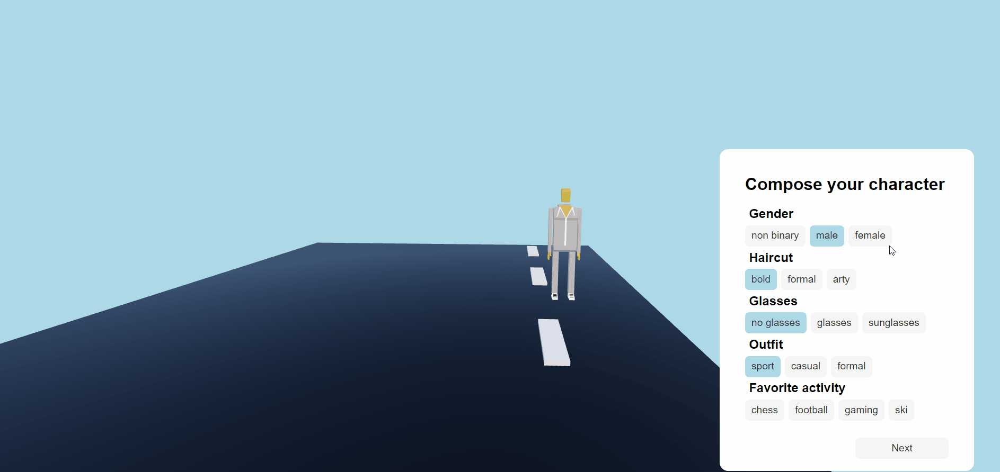

# 🕹️ Gamified Car Configurator 🚗

 

## About 📖

 

*This project was created in 3 days during the [MHP - A Porsche Company](https://www.mhp.com/en/home) "Mobility Hack 2022" Hackathon and earned us the second place. Your create your avatar, we create a car configuration for you.
We choose to build this configurator because usually people spend more time creating avatar as playing because it's fun.*

 

 

## Introduction

 

*Did you ever try to configure your dream car and felt like **drowning** in all the options and features?* 😖

*We feel you, we know the **frustration**, but we have a **solution**, using **gamification**.* 👍

 

---

## How does it work ? 🔧

 

*The idea was to create a **sophisticated algorithm** which we **simplified** a lot to be able to implement the idea in 3 days.*

 

(1) You **create an avatar** which corresponds to you.

(2) We perform a **profiling** and apply a **scoring** system.

(3) You got your **car configuration**, based on your **needs** and **lifestyle** !

 

> Let's **start customizing our Avatar**, first we have to fill in some input parameters.

 

 

> Damn ! That's exactly the car I was looking for ! 🚙 Let's take a look in the **showroom**, on the right side you can see all the addiotional options of the car.

 

 

---

## Business Model 📈

 

- SAAS (Software as a Service) on which car brands can register and enable users to configure their car through gamification.

- If an appointement is taken, we could charge the company.

 

---

 

## Roadmap 🚀

 

Actually the logic is pretty simple and based on "stereotypes"

-> **But**, by adding more **input parameters** we could find a better matching car.

-> Based on your **feeback** we could improve our configurator's **accuracy**

-> Aside of finding your car in **this world**, we could also help you to find your **virtual car** in the **Metaverse**.

 

---

 

## How to run the app locally 💻

- clone the repository ✔️

> git clone repo name

> cd repo name

- run the backend (default port: 4242) ✔️

> cd backend

> npm install

> npm start

- open another terminal and run the frontend (default port: 3000) ✔️

> cd frontend

> npm install

> npm start

- Your brower should open on localhost:3000 ✔️

**Enjoy!**

 

---

 

## Technologies 🧰

 

| Backend                     | Frontend | 3D |
| :---                          | :---        | :---           |
| [TypeScript](https://www.typescriptlang.org/)                          | [React](https://reactjs.org/)        | [Blender](https://www.blender.org/) |
| [Express](https://expressjs.com/) | [Three.js](https://threejs.org/) | |
| [AWS](https://aws.amazon.com/) | [Three Fiber](https://github.com/pmndrs/react-three-fiber) | |
| | [Three drei](https://github.com/pmndrs/drei) | |
| | [gltfjsx](https://github.com/pmndrs/gltfjsx) | |
| | [Sass](https://sass-lang.com/) | |

 

---

 

## The 'HEXAGON' Team ☄️

 

- [Mathieu](https://github.com/mathieu-superpose)
- [Jonathan](https://github.com/chronikum)
- [Olivier](https://github.com/FunkyOctopus)
- [William](https://github.com/williamollio)
- [Lucas](https://www.linkedin.com/in/lucaspouzadoux/)
- [Yavuz](https://github.com/yavuzsonmez)

 
