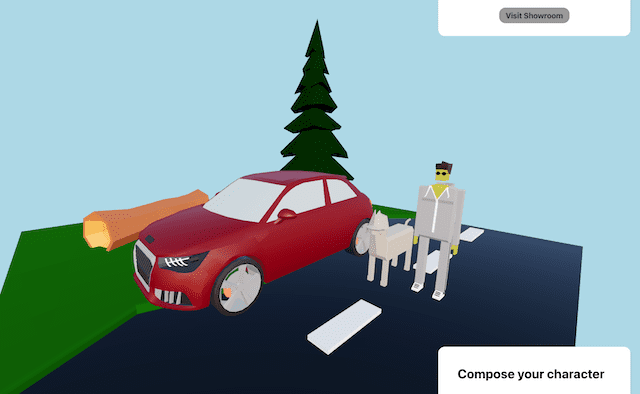

# Car Configurator

An automatic car configurator for the Mobility Hack 2022

  

## Technology

[React](https://reactjs.org/)

[Three.js](https://threejs.org/)

[Three Fiber](https://github.com/pmndrs/react-three-fiber)

[Three drei](https://github.com/pmndrs/drei)

[gltfjsx](https://github.com/pmndrs/gltfjsx)

[Sass](https://sass-lang.com/)

## Install

npm install

npm run start

The app is served on port 3000 by default